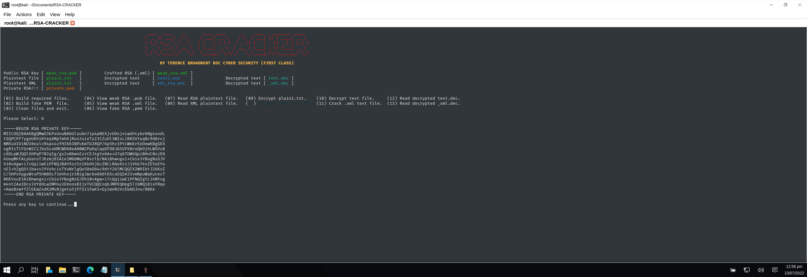

# RSA CRACKER
### A PYTHON SCRIPT FILE THAT CRACKS RSA ENCRYPTED MESSAGES VIA A WEAK .PUB KEY/.XML CALCULATION BY CREATING A FRAUDULENT PRIVATE KEY.

Usage: python rsa-cracker.py

| LANGUAGE | FILENAME       | MD5 HASH                         |
|------    |------          | -------                          |
| python   | rsa-cracker.py | 56a9d319d04cf0ba19e416b59574444f |
| python   | createfiles.py | 7baf1dba741d5140679ef0fe244de19f |

- [ ] Requires 3rd party [RsaCtfTool](https://github.com/sourcekris/RsaCtfTool) to be located within the sub directory.

## CONSOLE DISPLAY
 

