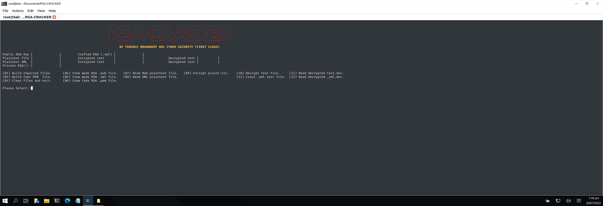

# RSA CRACKER 3.0
### A PYTHON SCRIPT FILE THAT CRACKS RSA ENCRYPTED MESSAGES VIA A WEAK .PUB KEY/.XML CALCULATION BY CREATING A FRAUDULENT PRIVATE KEY.

Usage: python3 rsa-cracker.py

| LANGUAGE | FILENAME       | MD5 HASH                         |
|------    |------          | -------                          |
| python   | rsa-cracker.py | 687daf4036991a83197eb085b70e4616 |
| python   | createfiles.py | 6f2e34896d98be45ce3f1e49ee92f134 |

- [X] Requires 3rd party [RsaCtfTool](https://pypi.org/project/rsactftool/)
pip3 install rsactftool --break-system-packages

## CONSOLE DISPLAY
 

