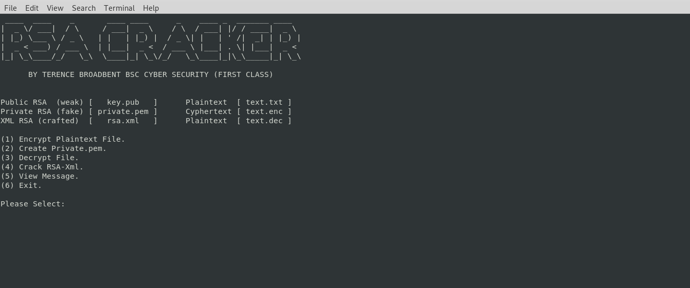

# RSA-CRACKER

Python script file to crack a RSA encrypted message via weak public key, or XML mathematical calculation.
Usage: python rsa-cracker.py

| LANGUAGE | FILENAME | MD5 Hash |
|------    |------    | -------  |
| python | rsa-cracker.py | MD5 Hash - 56a9d319d04cf0ba19e416b59574444f |
| python | createfiles.py | MD5 Hash - 7baf1dba741d5140679ef0fe244de19f |

- [ ] Requires 3rd party [RsaCtfTool](https://github.com/sourcekris/RsaCtfTool) to be located within the sub directory.

## CONSOLE DISPLAY
 

